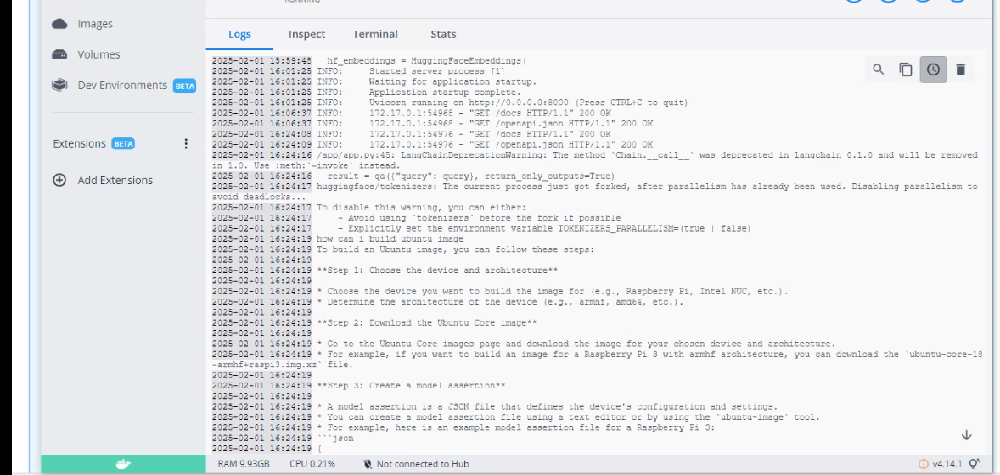
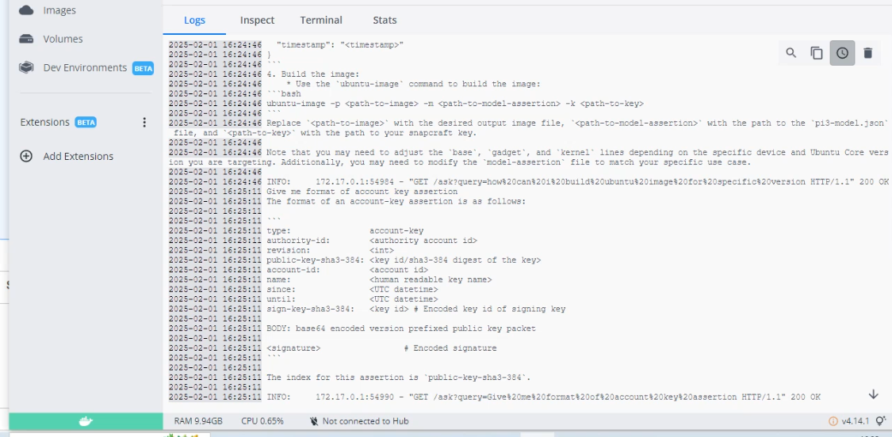

# Retrieval-Augmented Generation (RAG) Application

## 📌 Project Overview
This project implements a **Retrieval-Augmented Generation (RAG) pipeline** using **FAISS** for document retrieval and **Llama 3** for question-answering. The application allows users to ask questions based on a vectorized knowledge base and retrieves the most relevant documents to generate accurate responses.

## 🚀 Workflow
The RAG application follows these key steps:

### 1️⃣ Data Ingestion
- Markdown documents are read from the `/data/ubuntu-docs` folder.
- Documents are chunked into semantically meaningful pieces using **SemanticChunker**.
- The text embeddings are generated using **Hugging Face Embeddings** (`sentence-transformers/all-mpnet-base-v2`).

### 2️⃣ Vectorization & Storage
- The chunked documents are converted into vector embeddings.
- The embeddings are stored in a **FAISS** vector database for efficient similarity search.

### 3️⃣ Retrieval & Augmented Generation
- A user query is received through the API (`/ask` endpoint).
- The query is converted into an embedding and compared with stored vectors.
- The top **k=5** relevant documents are retrieved.
- The query and retrieved documents are passed to **Llama 3** for answer generation.

### 4️⃣ Response Generation
- The model generates an answer using both the retrieved context and its pre-trained knowledge.
- The final response includes:
  - The **query**
  - The **AI-generated answer**
  - The **retrieved source documents**

## 🖥️ API Usage
### **Endpoint**: `/ask`
```http
GET /ask?query=your_question_here
```
**Example Response:**
```json
{
    "query": "What is the latest version of Ubuntu?",
    "answer": "The latest version of Ubuntu as of 2024 is Ubuntu 24.04 LTS.",
    "retrieved_documents": "Ubuntu 24.04 LTS was released in April 2024..."
}
```

## 🛠️ Setup & Installation
1. Clone the repository:
   ```bash
   git clone https://github.com/your-repo.git
   cd your-repo
   ```
2. Install dependencies:
   ```bash
   pip install -r requirements.txt
   ```
3. Run the FAISS vector store creation:
   ```bash
   python vector_store.py
   ```
4. Start the FastAPI server:
   ```bash
   uvicorn main:app --host 0.0.0.0 --port 8000
   ```

## 📸 Example Results
Below is a exaomple result of the **Q&A bot**:





